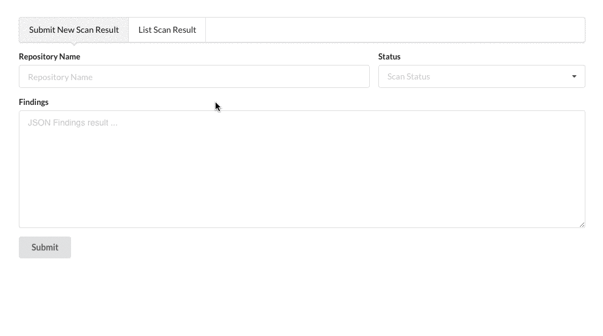
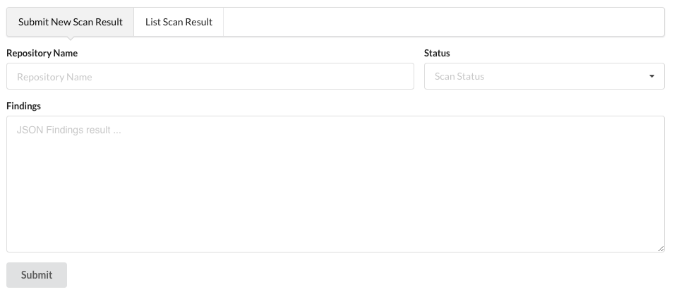
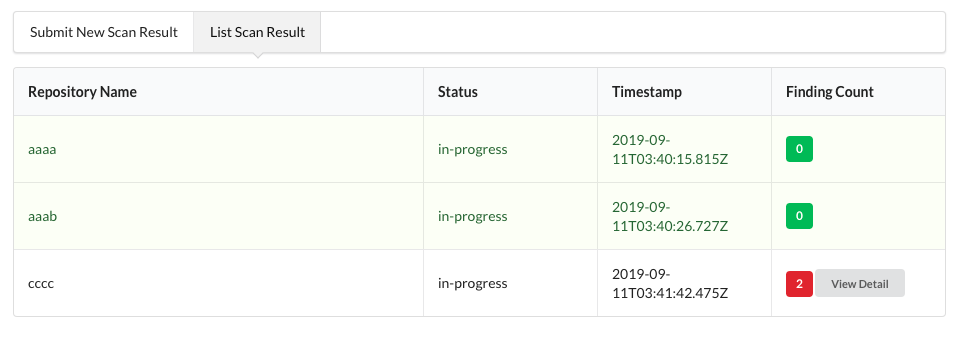
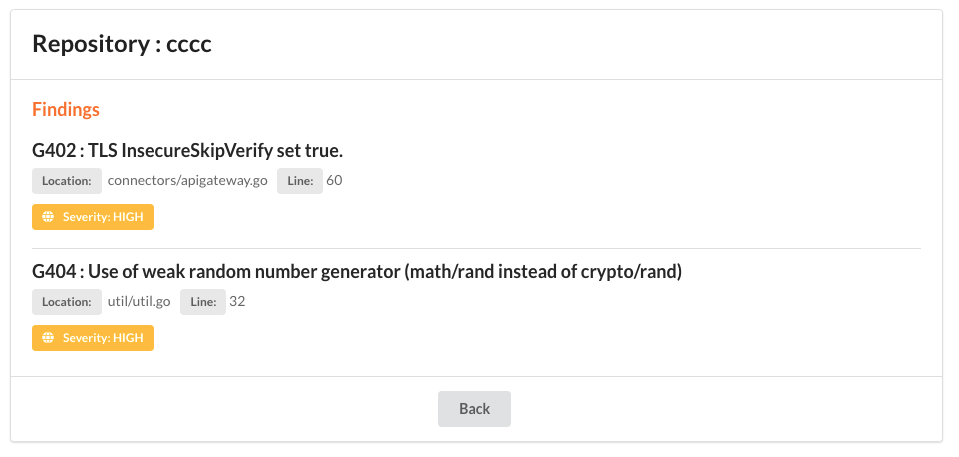

# Guard Dashboard
A Fullstack NodeJS/Web application demonstration



This repository consists of 2 modules which is:

- API
- Dashboard

# API

consist of 3 endpoints

### 1. Submit new scan result
```
POST /api/results
```
### 2. Retrieve all scan results
```
GET /api/results
```
### 3. Retrieve result by repository Id
```
GET /api/repository/:id/findings
```

# Dashboard
consist of 3 screens which are:

### 1. Submit New Scan Result
Display a form that allows submitting a scan result



### 2. List scan results
Displays a list of security scan results. The list should display the name of the repository, the status of the scan, and the according timestamp. If the Scan Report contains findings, display the number in a badge.


### 3. Finding detail
Displays the findings for a selected security scan.


# Prerequisite 
 - Docker

# Run Applications
 
 - start all servers by following command

 ```
 docker-compose up
 ```

 - system can access via http://localhost:3000


# Technology Stack
 - Nodejs
 - React
 - Postgres 11

# Note for Improvements
due to short period implementation time, there are many rooms for improvements which are:
- more unit tests on both API/Dashboard
- usage 3rd party logging / monitoring such as Datadog, Loggly, Newrelic
- scheduler/worker to fetch/pull scan result from other system to reduce manual insert result.
- PagerDuty for incident support